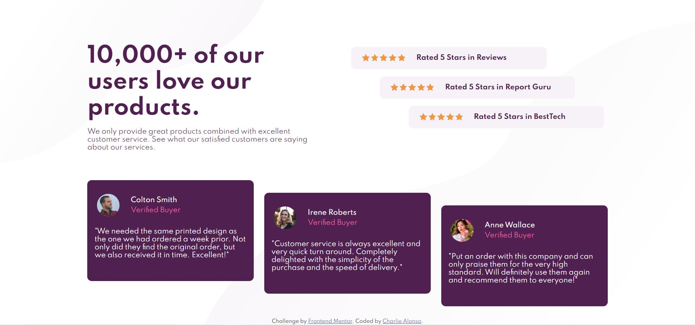

# Frontend Mentor - Social proof section solution

This is a solution to the [Social proof section challenge on Frontend Mentor](https://www.frontendmentor.io/challenges/social-proof-section-6e0qTv_bA). Frontend Mentor challenges help you improve your coding skills by building realistic projects. 

## Table of contents

- [Overview](#overview)
  - [The challenge](#the-challenge)
  - [Screenshot](#screenshot)
  - [Links](#links)
- [My process](#my-process)
  - [Built with](#built-with)
  - [What I learned](#what-i-learned)
  - [Continued development](#continued-development)
  - [Useful resources](#useful-resources)
- [Author](#author)

**Note: Delete this note and update the table of contents based on what sections you keep.**

## Overview

### The challenge

Users should be able to:

- View the optimal layout for the section depending on their device's screen size

### Screenshot

### Links

- Solution URL: [Social-proof-section](https://github.com/Charlie025x/Social-proof-section.git)
- Live Site URL: [Social-proof-section](https://charlie025x.github.io/Social-proof-section/)

## My process

### Built with

- CSS custom properties
- Flexbox
- CSS Grid
- Mobile-first workflow

### What I learned

I was able to combine what I learned about flex and grid to structure my desktop page. For this project I practiced using "nth-child" selectors to select my rating and review cards, and put used "align-self: center/flex-end" on those same cards to stager the cards across their container.

### Continued development

The site could still use work on the responsiveness, the desktop version doesn't look good when its too small in width or height. Plus it doesn't scroll.

### Useful resources

- [have two div blocks side by side, stackoverflow.com](https://stackoverflow.com/questions/37421874/having-two-div-blocks-aligned-side-by-side-wordpress-website) - Helped me reduce my 5 star rating cards from 2 horizontal blocks to 1 inline block.
- [:nth-child, mozilla.org](https://developer.mozilla.org/en-US/docs/Web/CSS/:nth-child) - Using :nth-child selectors I selected my cards to apply the staggering effect, as opposed to giveing each card a new class in the html. Ex .card-1, .card-2, .card-3
- [background images, w3schools](https://www.w3schools.com/css/css3_backgrounds.asp) - This w3schools page helped me add the light grey backgrounds on the body.

## Author

- Website - [Add your name here](https://www.your-site.com)
- Frontend Mentor - [@yourusername](https://www.frontendmentor.io/profile/yourusername)
- Twitter - [@yourusername](https://www.twitter.com/yourusername)